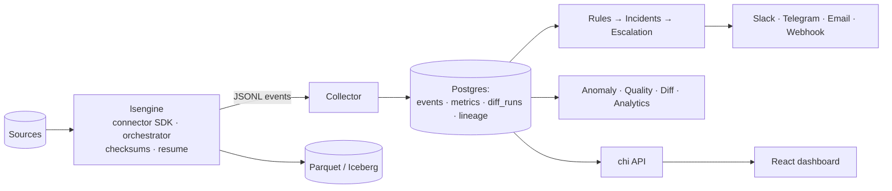

<div align="center">


### Your data pipelines, finally self-aware.

**LakeSense replicates 25+ sources into open lakehouse formats with its own
high-performance Go engine — then proves the data is correct, tells the right
person when it isn't, and gives away free what Fivetran, Monte Carlo, and
PagerDuty charge for.**

[](.github/workflows/ci.yml)
[](LICENSE)
[](engine)
[](frontend)

</div>

---

## What it is

LakeSense is a full data-pipeline platform in one repo:

- **A Go-native replication engine (`lsengine`)** — parallel-chunked full loads,
  logical-replication CDC, resumable state, and — uniquely — **order-independent
  checksums on both sides of every sync**, so each copy ships with proof it's
  correct.
- **An intelligence layer** — notifications with escalation & on-call, in-process
  anomaly detection, data-quality monitors, data-diff verification, column
  lineage, cost analytics, and LLM-drafted incident enrichment.

Everything below the open-core line is **free**.

## The wedge — free in LakeSense, paid elsewhere

| Capability | Who charges for it | In LakeSense |
|---|---|---|
| **Data-diff validation** (source ↔ destination checksums) | Datafold (paid product) | ✅ Free — on every sync |
| **Escalation policies & on-call** | PagerDuty (paid) | ✅ Free |
| **Audit logs** | Enterprise tiers, universally | ✅ Free |
| **Cost / volume analytics** | Fivetran (paid, and opaque) | ✅ Free — transparent model |
| **Column-level lineage** | Atlan / Monte Carlo (paid) | ✅ Free |
| **Data-quality monitors** | Monte Carlo (core paid product) | ✅ Free |
| **Config-as-code + rollback** | Enterprise APIs | ✅ Free |
| **Multi-environment promotion** | Team/Enterprise tiers | ✅ Free |
| **Point-in-time backfills** | Fivetran (paid) | ✅ Free |

SSO/RBAC and compliance packs are deliberately reserved for a future **Pro**
tier — the open-core line. Everything else is Apache-2.0.

## Quickstart (≤ 5 commands)

```bash
git clone https://github.com/mohdimran043/lakesense && cd lakesense/deploy
cp .env.example .env
docker compose up -d                         # migrations run on start
docker compose run --rm backend seed --days 14   # realistic demo data, no live DB needed
open http://localhost:3000                    # the dashboard
```

Prefer the API? `curl localhost:8080/api/v1/pipelines`. Prefer proof?
`make verify` runs an end-to-end migration-correctness check (source/destination
checksums must match) plus a whole-product feature proof.

**Benchmarks are yours, measured.** `make bench` migrates a 1M-row table and
reports rows/s and MB/s from the engine's own accounting — ~5.9M rows/min on a
20-core box (NDJSON writer; see [`docs/BENCHMARKS.md`](docs/BENCHMARKS.md)). We
never cite anyone else's numbers as ours.

## Create & run a pipeline

> **Status:** pipelines can be **created and run through the control-plane API** —
> `POST /api/v1/pipelines` (with automatic config versioning + audit on every
> change), then `POST /api/v1/pipelines/{id}/run` to execute one: the backend
> drives `lsengine` (discover → sync) and ingests the event stream, so real
> health, diff badges, and lineage flow into the dashboard. Runs also fire
> **automatically on a schedule** (`@hourly`/`@daily`/`@every 5m`), every
> ingested event is evaluated against your **rules** to open deduplicated
> **incidents** and dispatch **alerts**, and the API exposes the operational
> surface: incident `ack`/`snooze`/`resolve`, rule + channel management, config
> export, and `POST /pipelines/{id}/backfill`. The **engine CLI** (`lsengine`)
> flow below still works directly too (tested by `scripts/verify-migration.sh`).
> Landing next: the in-dashboard **create-pipeline wizard** (consumes the write API).

A pipeline is three JSON files — a source, a destination, and a stream catalog —
driven through four verbs: `spec` (see a connector's config schema), `check`
(validate connectivity), `discover` (list streams), and `sync` (replicate).

```bash
# 1. Inspect what a connector needs
lsengine spec --connector postgres

# 2. Describe your source (secrets via the file, never flags)
cat > source.json <<'JSON'
{ "type": "postgres", "host": "db.internal", "database": "shop",
  "user": "readonly", "password": "…", "chunk_strategy": "ctid" }
JSON

# 3. Validate connectivity + prerequisites (e.g. wal_level=logical for CDC)
lsengine check --config source.json

# 4. Discover streams, then choose what to sync and how
lsengine discover --config source.json > catalog.json
#    edit catalog.json → add "selected_streams":
#    [{ "namespace":"public","name":"orders","mode":"cdc" }]

# 5. Pick a destination — NDJSON or Parquet today; append-mode Iceberg in v0.2
echo '{ "type": "parquet", "path": "./out" }' > dest.json   # or "ndjson"

# 6. Replicate — resumable, with source/destination checksums on stdout
lsengine sync --config source.json --destination dest.json \
  --catalog catalog.json --state state.json
```

The `sync` command streams JSONL events (progress, per-stream `checksum_computed`
for both sides, `sync_finished`). Point the control plane's collector at a
pipeline and those events become the dashboard's health, diff badges, and
lineage. Run `sync` again with the same `--state` to resume or pick up CDC
changes. Full connector fields: [`lsengine spec`](engine) and the
[type-mapping analysis](docs/analysis).

## Supported sources

Maturity badges reflect the test battery a connector actually passes — a big
matrix with honest badges beats a big matrix of lies.

| Tier | Sources | Full load | Incremental | CDC | Badge |
|---|---|:---:|:---:|:---:|---|
| **A — Certified** | PostgreSQL | ✅ | ✅ | ✅ (pgoutput) | 🟢 Certified |
| **A-Compatible** | Aurora-PG, CockroachDB, TimescaleDB, AlloyDB, YugabyteDB | ✅ | ✅ | ⚠️ varies | 🟢 Stable |
| **A — Certified** | MySQL + MariaDB/Aurora/Percona/TiDB/Vitess | ✅ | ✅ | binlog | 🟡 Roadmap |
| **B — Stable** | MongoDB, SQL Server, Kafka | ✅ | ✅ | where available | 🟡 Roadmap |
| **C — Beta** | **SQLite** (shipping), Oracle, DB2, ClickHouse, Cassandra, DynamoDB, Elasticsearch, Redis, Object Storage (S3/GCS/Azure/MinIO) | ✅ | ✅ | roadmap | 🔵 Beta |

**Shipping today:** PostgreSQL (full + CDC) and SQLite (full + incremental,
server-less — powers the demo and the self-test canary). The rest ship as honest
"Beta / Coming soon" until they pass their battery against a real service. See
the public [roadmap](docs/BUSINESS.md#roadmap).

## Architecture



Full write-up: [`docs/ARCHITECTURE.md`](docs/ARCHITECTURE.md) ·
spec: [`docs/SPEC.md`](docs/SPEC.md) · business: [`docs/BUSINESS.md`](docs/BUSINESS.md).

## Repository

```
engine/     lsengine — connectors, syncrun orchestrator, SDK, events, state
backend/    control plane — API, collector, rules, escalation, anomaly, quality, enrich, correlate
frontend/   React + TypeScript dashboard ("abyssal depth-sounder" design system)
deploy/     docker-compose + nginx + env template
scripts/    solo-founder verification suite (make verify)
docs/       analysis (clean-room bridge), spec, architecture, business
```

## Development

```bash
make check        # lint + vet + -race tests (engine + backend) + frontend build
make verify       # migration-correctness + whole-product feature proofs
```

## Provenance & license

LakeSense's engine architecture was informed by studying open-source projects
including **OLake** (Apache 2.0) — as a clean reimplementation, not a fork; no
upstream code is copied (see [`NOTICE`](NOTICE) and the clean-room analysis in
[`docs/analysis/`](docs/analysis)). Benchmarks, where published, are LakeSense's
own measurements.

Licensed under the **Apache License 2.0** ([`LICENSE`](LICENSE)) — open-core:
the entire current product is free, with SSO/RBAC reserved for a future Pro tier.
