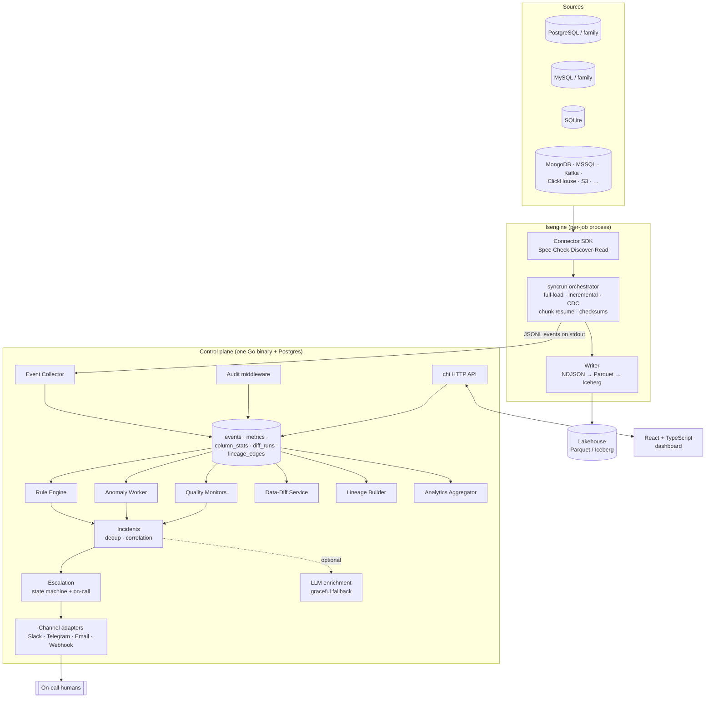

# LakeSense Architecture

LakeSense is two cooperating pieces:

1. **The engine (`lsengine`)** — a Go replication engine invoked per pipeline
   run. It reads a source, writes an open lakehouse format, and emits a
   structured **JSONL event stream** on stdout (the engine↔platform contract,
   defined once in `engine/internal/events`).
2. **The control plane (`lakesense`)** — a single Go binary bundling the API
   and every background worker, backed by Postgres. It launches the engine,
   ingests its events, and layers on the intelligence features (notifications,
   escalation, anomaly detection, data-quality monitors, data-diff, lineage,
   analytics, audit, config versioning, environments, backfills).

A React + TypeScript dashboard talks to the control-plane API.

## System diagram



## Data flow

1. The control plane launches `lsengine sync` for a pipeline on its schedule,
   passing source/destination configs and the stream catalog as files.
2. The engine runs the sync and streams JSONL events (`sync_started`,
   `stream_started`, `chunk_completed`, `state_advanced`, `checksum_computed`
   ×2, `schema_changed`, `column_mapping`, `sync_finished`, …).
3. The **collector** parses each line and lands it in `events`, then fans out
   derived rows: `metrics`, `column_stats`, `diff_runs` (source vs destination
   checksums → the "✓ verified" badge), `lineage_edges`.
4. Workers read the derived tables: the **rule engine** evaluates conditions and
   opens deduplicated **incidents**; the **anomaly** and **quality** workers add
   `anomaly_detected` / monitor-breach events into the same pipeline;
   **escalation** drives on-call notification steps until an incident is acked.
5. Everything is queryable through the API and rendered by the dashboard.

## Key design decisions

- **One control-plane binary, no Temporal.** Workers are goroutines coordinated
  by `context` + `errgroup`; scheduling is in-process with a fake-clock-testable
  worker. Rationale: `docs/analysis/control-plane.md` §6.
- **The engine owns correctness instrumentation.** Order-independent per-stream
  checksums are computed on both the rows read from source and the rows written
  to destination, in the same run — this is what makes the data-diff badge
  trustworthy rather than decorative. Ack-before-state (write-ahead flush at
  every state-commit boundary) keeps a crash from ever losing rows a
  completed-chunk marker claims are durable.
- **The event schema is the contract.** It is versioned (`v` in the envelope)
  and designed once in `engine/internal/events`; the collector consumes it
  verbatim. Additive changes keep `v=1`.
- **LLM features degrade gracefully.** Enrichment and digests fall back to
  raw-but-complete output when no API key is set or the API errors — the product
  is fully functional without an LLM.
- **Writers are pluggable behind one interface** (`syncrun.Writer`). v0.1 ships
  a rock-solid NDJSON writer; Parquet and append-mode Iceberg (pure-Go REST
  catalog commit) land behind the same interface without touching the engine
  core. Rationale: `docs/analysis/writers.md` §4.

## Repository layout

```
engine/     lsengine: cmd/lsengine + internal/{connectors,syncrun,sdk,events,state,model,config}
backend/    lakesense: cmd/lakesense + internal/{api,store,config,...}; migrations embedded in store/
frontend/   React + TypeScript + Vite + Tailwind dashboard
docs/        analysis (clean-room bridge), SPEC, ARCHITECTURE, BENCHMARKS
docs-site/   Docusaurus product documentation
website/     marketing site (React Three Fiber)
deploy/      docker-compose + env templates
scripts/     solo-founder verification & ops automation
```
